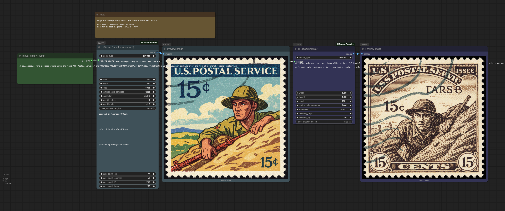

## Updates 14.04.

- fixed uncensored llm support
- fixed pipelines
- fixed image output
- fixed cache overload
- Added multi image generation (up to 8) (Img2img not yet supported!)
- Fixed Sageattention fetch as first attention method.
- Fixed according to [burgstall](https://github.com/Burgstall-labs): Not require auto-gptq anymore! Make sure to git pull and pip install -r requirements.txt! 
- Added Image2image functionality
- Flash Attention is no longer needed thanks to [power88](https://github.com/power88)
- added working uncensored Llama Support (Available via HiDream Sampler Advanced) thanks to [sdujack2012](https://github.com/sdujack2012) but beware its not quantified so you could get an OOM



# HiDreamSampler for ComfyUI

A custom ComfyUI node for generating images using the HiDream AI model.

## Features
- Supports `full`, `dev`, and `fast` model types.
- Configurable resolution and inference steps.
- Uses 4-bit quantization for lower memory usage.

## Installation
### Basic installation.
1. Clone this repository into your `ComfyUI/custom_nodes/` directory:
   ```bash
   git clone https://github.com/lum3on/comfyui_HiDream-Sampler ComfyUI/custom_nodes/comfyui_HiDream-Sampler
   ```

2. Install requirements
    ```bash
    pip install -r requirements.txt
    ```
    or for the portable version:
   ```bash
   .\python_embeded\python.exe -m pip install -r .\ComfyUI\custom_nodes\comfyui_HiDream-Sampler\requirements.txt
   ```
   
4. Restart ComfyUI.

Steps to install SageAttention 1:
- Install triton.
Windows built wheel, [download here](https://huggingface.co/madbuda/triton-windows-builds):
```bash
.\python_embeded\python.exe -s -m pip install (Your downloaded whl package)
```
linux:
```bash
python3 -m pip install triton
```

- Install sageattention package
```bash
.\python_embeded\python.exe -s -m pip install sageattention==1.0.6
```
PyTorch SDPA is automantically installed when you install PyTorch 2 (ComfyUI Requirement). However, if your torch version is lower than 2. Use this command to update to the latest version.
- linux
```
python3 -m pip install torch torchvision torchaudio
```
- windows
```
.\python_embeded\python.exe -s -m pip install torch torchvision torchaudio --index-url https://download.pytorch.org/whl/cu124
```

## Download the weights
Here's some weight that you need to download (Which will be automantically downloaded when running workflow). Please use huggingface-cli to download.
- Llama Text Encoder

| Model | Huggingface repo | 
|------------------------|---------------------------|
| 4-bit Llama text encoder       | hugging-quants/Meta-Llama-3.1-8B-Instruct-GPTQ-INT4  | 
| Uncensored 4-bit Llama text encoder      | John6666/Llama-3.1-8B-Lexi-Uncensored-V2-nf4  | 
| Original Llama text encoder       | nvidia/Llama-3.1-Nemotron-Nano-8B-v1  | 

- Quantized Diffusion models (Thanks to `azaneko` for the quantized model!)

| Model | Huggingface repo | 
|------------------------|---------------------------|
| 4-bit HiDream Full       | azaneko/HiDream-I1-Full-nf4  | 
| 4-bit HiDream Dev       | azaneko/HiDream-I1-Dev-nf4  | 
| 4-bit HiDream Fast       | azaneko/HiDream-I1-Fast-nf4  | 

- Full weight diffusion model (optional, not recommend unless you have high VRAM)

| Model | Huggingface repo | 
|------------------------|---------------------------|
| HiDream Full       | HiDream-ai/HiDream-I1-Full  | 
| HiDream Dev       | HiDream-ai/HiDream-I1-Dev  | 
| HiDream Fast       | HiDream-ai/HiDream-I1-Fast  | 

You can download these weights by this command.
```shell
huggingface-cli download (Huggingface repo)
```
For some region that cannot connect to huggingface. Use this command for mirror.

Windows CMD
```shell
set HF_ENDPOINT=https://hf-mirror.com
```
Windows Powershell
```shell
$env:HF_ENDPOINT = "https://hf-mirror.com"
```
Linux
```shell
export HF_ENDPOINT=https://hf-mirror.com
```

## Usage
- Add the HiDreamSampler node to your workflow.
- Configure inputs:
    model_type: Choose full, dev, or fast.
    prompt: Enter your text prompt (e.g., "A photo of an astronaut riding a horse on the moon").
    resolution: Select from available options (e.g., "1024 × 1024 (Square)").
    seed: Set a random seed.
    override_steps and override_cfg: Optionally override default steps and guidance scale.
- Connect the output to a PreviewImage or SaveImage node.

## Requirements
- ComfyUI
- GPU (for model inference)

## Notes
Models are cached after the first load to improve performance and use 4-bit quantization models from https://github.com/hykilpikonna/HiDream-I1-nf4.
Ensure you have sufficient VRAM (e.g., 16GB+ recommended for full mode).

## Credits

Merged with [SanDiegoDude/ComfyUI-HiDream-Sampler](https://github.com/SanDiegoDude/ComfyUI-HiDream-Sampler/) who implemented a cleaner version for my originial NF4 / fp8 support.

- Added NF4 (Full/Dev/Fast) download and load support
- Added better memory handling
- Added more informative CLI output for TQDM

- Full/Dev/Fast requires roughly 27GB VRAM
- NF4 requires roughly 15GB VRAM

Build upon the original [HiDream-I1]https://github.com/HiDream-ai/HiDream-I1
